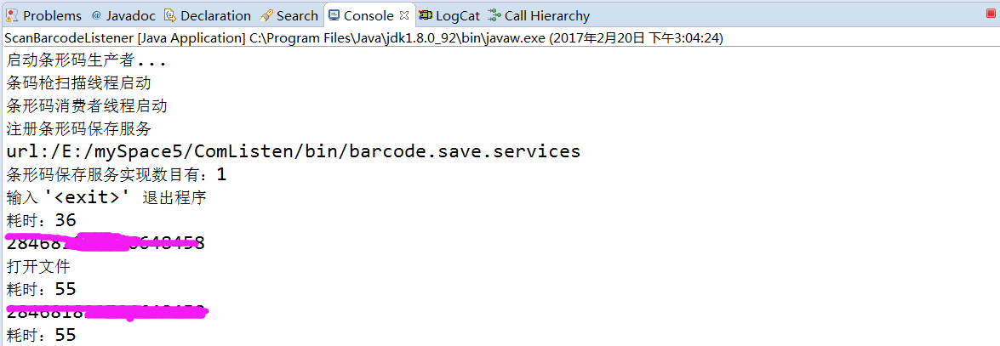

# BarCodeScanner
Java 接收扫码枪数据

* 首先要告诉你个秘密，扫码枪就是=键盘+回车，所以你建个txt文本文档或者doc随便，打开，然后连接扫码枪，开始扫描，变会自动录入到你的文档；
* 然后，这个项目要给你讲的是，java程序上接收扫码枪数据。

### 运行效果

<a href="./art/display.png"></a>

### 代码
运行ScanBarcodeListener.java就可以了，直接看看代码吧！

### 联系我

* 新浪微博：[@淡墨沁心](http://weibo.com/leafseelight)
* Email：ye.jg@outlook.com

### 如能荣幸给您带来帮助，并且乐意的话，可以在Demo中关于我的界面，支持一下我→ 微信or支付宝orPaypal

* <a href="./art/wechatpay.png"></a>    <a href="./art/alipay.jpg"></a>
* <a href="intent://platformapi/startapp?saId=10000007&clientVersion=3.7.0.0718&qrcode=https://qr.alipay.com/aex03674qm0prhhrtepjcbb&_t=1472443966571#Intent;scheme=alipayqr;package=com.eg.android.AlipayGphone;end">手机支付宝打赏</a>
* <a href="https://www.paypal.me/yejg">Paypal.me</a>

### License

```
Copyright 2017 leafseelight

Licensed under the Apache License, Version 2.0 (the "License");
you may not use this file except in compliance with the License.
You may obtain a copy of the License at

    http://www.apache.org/licenses/LICENSE-2.0

Unless required by applicable law or agreed to in writing, software
distributed under the License is distributed on an "AS IS" BASIS,
WITHOUT WARRANTIES OR CONDITIONS OF ANY KIND, either express or implied.
See the License for the specific language governing permissions and
limitations under the License.
```